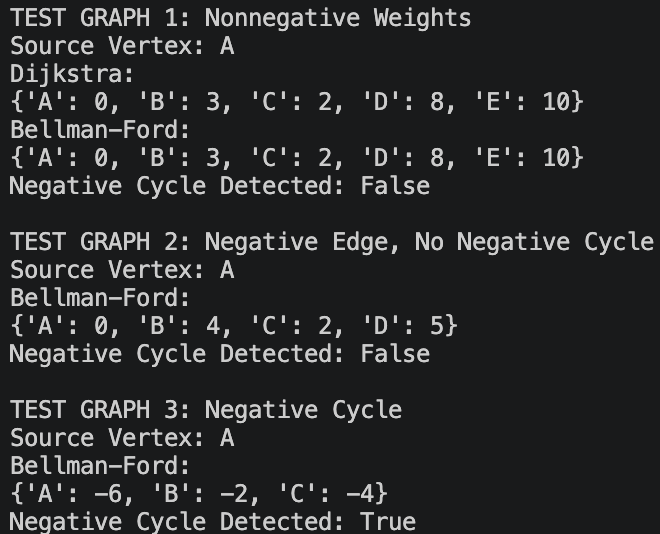

# CS 5329 Module 7: Shortest-Path Algorithms Report

## 1. Explanation of Weighted Graphs
Weighted graph is a graph where each edge has an associated numeric value. The graph in this program is directed. That is, an edge between one vertex and another vertex does not automatically generate an edge between the latter one and former one.
Vertices are the points in a graph. The vertices in this program are represented by letter names such as A, B, C, D, and E.
Edges are connections between vertices. Edges have weights that indicate cost of traveling between vertices. The weights could mean something different depending on the problem (distance, cost, travel time, network delay, etc.)
Graph is stored in the form of adjacency list. Adjacency list is a structure implemented as Python dictionary. Each vertex is a key in the dictionary and the value of a key is a list of destination vertices and weights of the edges.

For example:
```python
"A": [("B", 4), ("C", 2)]
```
It means that there are edges from vertex A to vertex B and C with weight 4 and 2 correspondingly.
The adjacency list makes it easier to access the neighbors of a vertex during shortest path computation.

## 2. Explanation of Relaxation
Relaxation is the process of checking whether a shorter path to a vertex has been found.
Initially, all vertices except for the source vertex have a distance equal to infinity since no path to those vertices has been found yet. The source vertex has a distance of 0.
For an edge going from vertex U to vertex V with weight W, the algorithm checks whether the sum of current distance to U plus W is less than the current distance to V.
That is, the following condition is evaluated:
```text
distance[U] + weight < distance[V]
```
If it is true, then the distance to V is updated.
For example, if the current distance to A is 0 and there is an edge with weight 4 going from A to B, then B's distance can be updated from infinity to 4.
Relaxation is performed multiple times since a later path may allow finding a shorter route. For example, if the program finds later a path from A to C with cost 2 and an edge with weight 1 from C to B, then the distance to B is 3 instead of 4.
Dijkstra's algorithm performs relaxation on vertices that have been selected using priority queue. Bellman-Ford performs repeated relaxation over all edges.

## 3. Dijkstra's Algorithm
Dijkstra's algorithm finds the shortest-path distances from a selected source vertex to other reachable vertices in a weighted graph.
The implementation starts with assigning the source vertex a distance of 0 and assigning all other vertices a distance of infinity.
The priority queue is built using Python's heapq library. Priority queue stores vertices based on the current shortest distance.
The algorithm removes the vertex with the smallest distance from the priority queue and evaluates neighboring vertices. If a shorter path is found, then the distance is updated and placed into the priority queue again.
Priority queue is convenient since it allows selecting efficiently the vertex with the smallest distance.
The correct operation of Dijkstra's algorithm relies on nonnegative edge weights. That is, if all edge weights are nonnegative, then once the algorithm finds the shortest distance to a vertex, a later path cannot update that distance using a negative edge.
Presence of negative edges in the graph may result in incorrect behavior of the algorithm since vertex that is believed to have the final distance may receive a smaller distance using a negative edge.

The expected runtime of this implementation is:
```text
O((V + E) log V)
```
where `V` stands for the number of vertices and `E` for the number of edges.

## 4. Bellman-Ford Algorithm
Bellman-Ford is an algorithm calculating shortest-path distances from a selected source vertex.
Similar to Dijkstra's algorithm, Bellman-Ford starts with assigning the source vertex a distance of 0 and all other vertices a distance of infinity.
Program builds the list of all edges in the graph and repeatedly relaxes all edges.
Bellman-Ford performs at most `V - 1` iterations of relaxation because the shortest path can consist of at most `V - 1` edges.
Unlike Dijkstra's algorithm, Bellman-Ford can correctly process the presence of negative edge weights.
After the normal iterations of relaxation have completed, the algorithm performs an additional iteration.

If an edge can be relaxed after it, then the graph has a reachable negative cycle.

A negative cycle is a cycle with a sum of its edges' weights that is less than zero. Thus, traveling around the cycle any number of times will result in the further decrease of the total cost of the route and, consequently, no finite shortest path exists for the affected vertices.
The expected complexity of Bellman-Ford is:
```text
O(VE)
```
where `V` is the number of vertices and `E` is the number of edges.
## 5. Test Results
### Test Graph 1: Nonnegative Weights
The first test graph has five vertices with only nonnegative edge weights.
The edges are:
```text
A -> B = 4
A -> C = 2
C -> B = 1
B -> D = 5
C -> D = 8
D -> E = 2
C -> E = 10
```
The source vertex is:
```text
A
```
Dijkstra's algorithm has returned:
```text
{'A': 0, 'B': 3, 'C': 2, 'D': 8, 'E': 10}
```
Bellman-Ford algorithm has returned:
```text
{'A': 0, 'B': 3, 'C': 2, 'D': 8, 'E': 10}
```
Negative cycle detected:
```text
False
```

In case of the first graph, both algorithms gave identical results for shortest path distances.
### Test Graph 2: Negative Edge but no Negative Cycle
The edges of the second test graph are
```text
A -> B = 4
A -> C = 5
B -> C = -2
C -> D = 3
```
and the selected source vertex is
```text
A
```
The result produced by Bellman-Ford is the following
```text
{'A': 0, 'B': 4, 'C': 2, 'D': 5}
```
Negative cycle detected:
```text
False
```
A negative edge B-C makes the shortest path to C more affordable.
Although the path from A to C costs 5 units, the path from A to B to C costs:
```text
4 + (-2) = 2
```
Thus, the presented example demonstrates the need for Bellman-Ford in case of negative edges.
### Test Graph 3: Negative Cycle
The edges of the third test graph are
```text
A -> B = 1
B -> C = -2
C -> A = -2
```
The source vertex is chosen as:
```text
A
```
The total weight of the negative cycle is
```text
1 + (-2) + (-2) = -3
```
The following is the result of Bellman-Ford before the detection of the negative cycle:
```text
{'A': -6, 'B': -2, 'C': -4}
```
Negative cycle detected:
```text
True
```
Negative values keep decreasing because the cost of a path becomes smaller each time the negative cycle is used.
Thus, there are no finite distances for vertices which belong to the negative cycle.

## 6. Dijkstra vs. Bellman-Ford Algorithm Comparison
The preferred algorithm will be Dijkstra if all edge weights are nonnegative. The algorithm usually performs better than Bellman-Ford thanks to the use of the priority queue.
The preferred algorithm will be Bellman-Ford if a graph can have negative edges. Although Bellman-Ford is slower, it is able to process negative edges and detect negative cycles.
Negative edges are critical for selecting an algorithm because Dijkstra assumes that distances cannot decrease due to a negative edge. However, Bellman-Ford does not make this assumption since it processes all edges repeatedly.
The presence of the negative cycle influences the definition of the shortest path because it allows reducing the cost of a path every time it is used. Therefore, there is no finite distance for vertices which belong to the negative cycle.
Dijkstra's and Bellman-Ford algorithms differ from minimum spanning tree algorithms because shortest path algorithms determine the minimum-cost route from the source vertex to other vertices. In turn, minimum spanning tree algorithms determine the subset of edges which connects all vertices with the smallest total weight.
A minimum spanning tree is not concerned about shortest paths from the source vertex.
## 7. Reflection
This exercise gave me great practical experience in how shortest-path algorithms balance their trade-offs, keep states, and make their decisions on each iteration. Though I understood the theoretical difference between Dijkstra's algorithm and Bellman-Ford's one before this assignment, examining how they worked in the real world helped me see why there is such a huge discrepancy between these algorithms in terms of runtime complexity, functionality, and edge cases.
The most important lesson from this assignment was seeing how the basics of edge relaxation work as distance estimates are constantly updated as shorter distances to the destination vertex are found. Seeing how the priority queue in Dijkstra's algorithm quickly extracts the vertexes with minimum distance demonstrated how effective greedy choices are under certain constraints. On the other hand, the process of passing through the entire graph in Bellman-Ford showed how the structural simplicity of this algorithm gives more flexibility in solving problems related to negative edge weights.
Moreover, performing the test with negative cycle showed that Dijkstra's algorithm depends on non-negative edge weights. The additional pass of the Bellman-Ford algorithm proved crucial in detecting these reduction loops. Overall, estimating runtimes of both algorithms in empirical and asymptotic terms helped understand what exactly is being sacrificed in the design of an algorithm.
